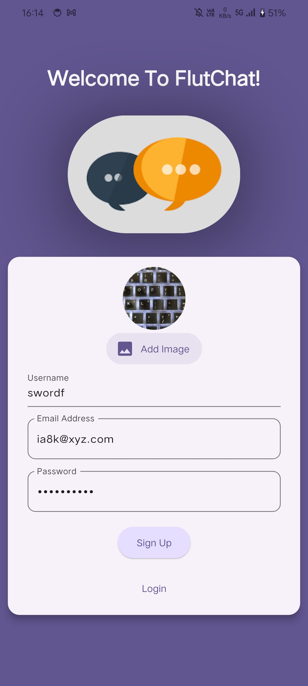
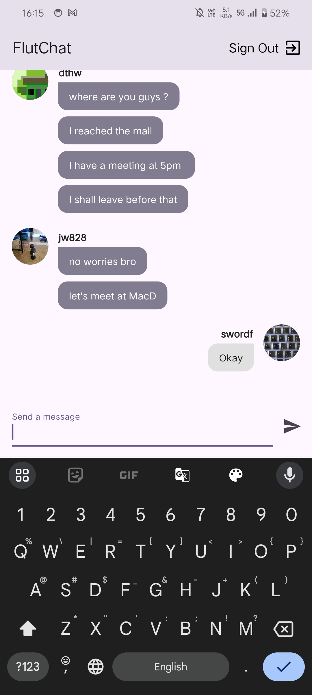

# Group Chat Application with Flutter & Firebase 📱💬

This Flutter application provides a unified group chat experience for authenticated users. The app leverages Firebase for real-time messaging, secure user authentication, and profile management, delivering a seamless and cohesive communication platform.

## Core Features

**Universal Group Chat**: A single chat room where all authenticated users can participate. This universal chat allows real-time message exchange, ensuring all users are always in sync with ongoing conversations.

**User Authentication**: Firebase Authentication is utilized to manage user sign-up and login processes. During registration, users are required to provide a unique username and profile picture, which are stored and managed in Firestore.

**Profile Setup**: Users must set up their profile with a unique username and profile photo at the time of registration. This information is critical for identifying users in the chat.

**Real-Time Messaging**: Powered by Firebase Firestore, the app supports real-time message synchronization. All users receive messages instantaneously, with messages displayed in chronological order.

**Responsive UI**: The application is designed to be responsive, ensuring compatibility across different devices and screen sizes. The UI dynamically adapts to maintain a consistent and user-friendly experience.

## Screenshots

### Sign-Up Screen



### Chat Screen




## Technical Overview

**State Management**: The app employs `flutter_riverpod` for state management, offering a streamlined and reactive architecture. Riverpod providers efficiently manage the app's state, ensuring a maintainable and scalable codebase.

**User Interface and UX**:
* **Message Display**: The chat interface is built using a combination of Flutter's `ListView` and custom `ChatMessage` widgets. Messages include metadata such as sender name and timestamp, enhancing the chat experience.
* **SnackBars**: SnackBars are implemented to provide users with real-time feedback, such as confirmation of message sending or alerts for network issues.
* **Static Profile Display**: Usernames and profile pictures are set during registration and displayed consistently throughout the chat interface. No further profile updates are allowed, ensuring data consistency.

**Data Handling and Persistence**:
* **Firestore Integration**: Messages and user profiles are stored in Firestore. The chat collection holds all messages, each document containing message content, sender ID, timestamp, and other relevant metadata.
* **Real-Time Listeners**: Firestore's real-time listeners are used to sync chat messages across all clients instantly. This ensures that all users receive the latest messages without manual refreshes.

**Security and Data Privacy**:
* **Firebase Security Rules**: Custom security rules are implemented to ensure data integrity and privacy. Only authenticated users can read and write messages, and access to user profiles is restricted based on authentication status.

## Future Enhancements

**Push Notifications**: Planned implementation of push notifications using Firebase Cloud Messaging's (FCM) topic messaging service. This feature will notify users of new messages even when the app is not actively running, ensuring they stay informed about ongoing conversations in the universal group chat.

## Installation and Setup

To run the application locally, follow these steps:

1. **Clone the Repository**:
    ```bash
    git clone https://github.com/dshryn/grp-chat-app.git
    cd grp-chat-app
    ```

2. **Install Dependencies**:
    ```bash
    flutter pub get
    ```

3. **Firebase Configuration**:
    * Set up Firebase for the project by adding the required configuration files (`google-services.json` for Android and `GoogleService-Info.plist` for iOS) and enabling Firestore and Authentication in the Firebase console.

4. **Run the Application**:
    ```bash
    flutter run
    ```

## Dependencies

```yaml
dependencies:
  flutter:
    sdk: flutter
  firebase_core: ^2.8.0
  firebase_auth: ^4.8.2
  cloud_firestore: ^5.5.0
  flutter_riverpod: ^2.5.1
  cupertino_icons: ^1.0.2
  image_picker: ^0.8.4+2
  provider: ^6.0.1
